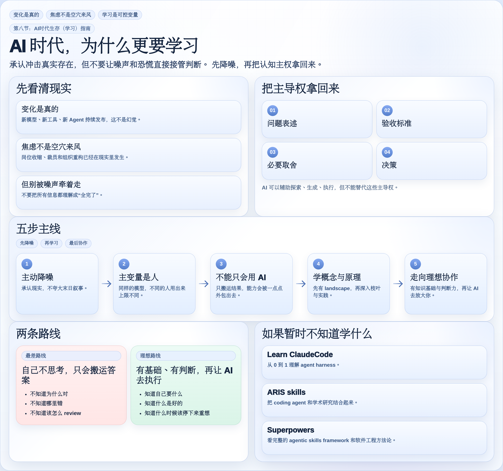
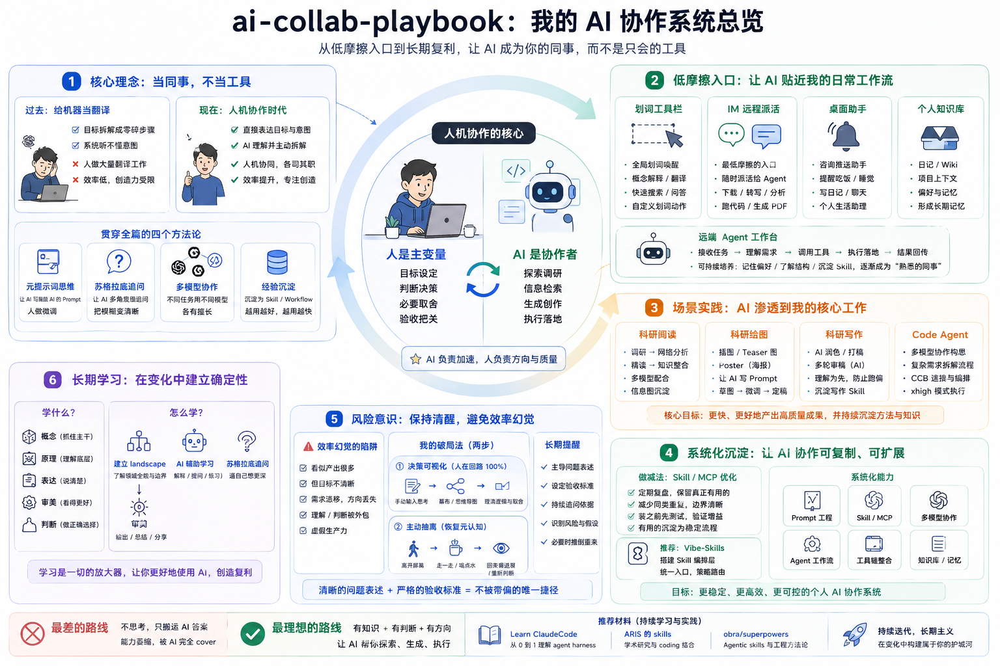
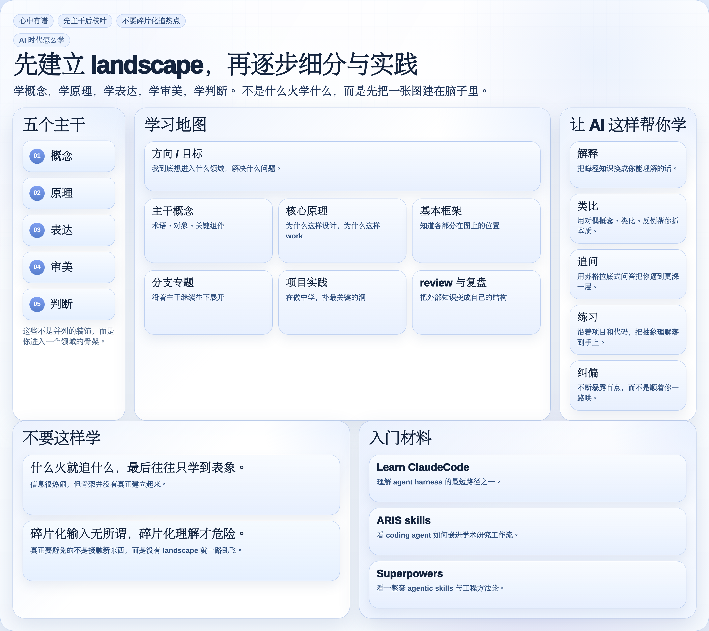

# AI Collab Playbook

[中文](README.md) | English

A practical AI collaboration playbook for research, writing, reading, coding, and everyday learning. This is not just a tool list or a prompt cookbook; it is about human-led collaboration: putting AI into real workflows while keeping problem framing, quality judgment, trade-offs, and learning in human hands.

The main article is still the center of the repository. The surrounding rules, prompts, figures, and skill index are here to make the workflow reusable rather than merely inspirational.

## Contents

- **Main article (2026-04-26 edition)**: [`docs/phd-ai-collab.md`](docs/phd-ai-collab.md)
- **AI-era Survival (Learning) Guide**: [`docs/phd-ai-collab.md#ai-learning-guide`](docs/phd-ai-collab.md#ai-learning-guide)
- **Working rules**: [`AGENTS.md`](AGENTS.md) / [`CLAUDE.md`](CLAUDE.md)
- **Prompts**: [`prompts/`](prompts)
- **Figures**: [`docs/figs`](docs/figs)
- **Full skills**: [`skills/full/README.en.md`](skills/full/README.en.md)


## Core Ideas

```text
Human as variable    AI amplifies capability, but does not replace judgment
Colleague mindset    Put AI into real workflows, not only Q&A windows
Low-friction entry   Put AI where materials, thoughts, and tasks already appear
Context first        Prepare goals, materials, preferences, and acceptance criteria
Reusable practice    Turn useful routines into skills, then prune the noise
Anti-efficiency fog  Do not outsource understanding, taste, trade-offs, or learning
```

[](docs/phd-ai-collab.md)

## What's in this update

The public edition is now synced to `2026-04-26`. This update expands the playbook beyond coding into everyday learning, visual understanding, remote agents, GPT-Image-2 style context-to-image workflows, and a more explicit warning about efficiency theater. If you only want the images, go to [`docs/figs`](docs/figs). If you want the reasoning around them, start with the article.

## Figure Preview

<table>
  <tr>
    <td align="center" width="33%">
      <a href="docs/phd-ai-collab.md#ai-learning-guide"></a><br>
      <sub><strong>Learning guide</strong></sub><br>
      <sub>How I try to stay clear-headed when the noise gets loud.</sub>
    </td>
    <td align="center" width="33%">
      <a href="docs/phd-ai-collab.md#code-agent-framework"></a><br>
      <sub><strong>AI collaboration framework</strong></sub><br>
      <sub>How low-friction entry points, context, models, and agents become one system.</sub>
    </td>
    <td align="center" width="33%">
      <a href="docs/phd-ai-collab.md#ai-learning-roadmap"></a><br>
      <sub><strong>Learning roadmap</strong></sub><br>
      <sub>What I still think is worth learning in the AI era.</sub>
    </td>
  </tr>
</table>

## What Else Is in the Repo

- **Working rules**: [`AGENTS.md`](AGENTS.md) / [`CLAUDE.md`](CLAUDE.md)
- **Prompts**: [`prompts/`](prompts)
- **Full skills**: [`skills/full/README.en.md`](skills/full/README.en.md)
- **Update cadence**: the public version is usually synced on Fridays, with earlier updates when something meaningfully changes.

## External Posts

- **Xiaohongshu post**: <https://www.xiaohongshu.com/discovery/item/69ab040f000000001a02d99e?source=webshare&xhsshare=pc_web&xsec_token=LBModFyJ1bo4oqM2YmRbD3X0SpH1wO_Yo72JPNGieHJRo=&xsec_source=pc_share>

## Feedback

- **Drop a comment, leave feedback, or share your own adaptation**: <https://github.com/cnfjlhj/ai-collab-playbook/discussions/1>
- **Corrections, structural feedback, or content fixes**: <https://github.com/cnfjlhj/ai-collab-playbook/issues/new/choose>

## Working Rules

- [`AGENTS.md`](AGENTS.md): working rules for Codex and general agents
- [`CLAUDE.md`](CLAUDE.md): working rules for Claude Code style workflows

These files are not decoration. They are the rules I actually use, so if you also want AI inside your real workflow, they are worth reading early.

## Prompts

These are prompt files I reuse a lot:

- [`prompts/提示词优化器.md`](prompts/提示词优化器.md)
- [`prompts/概念解释器.md`](prompts/概念解释器.md)
- [`prompts/视频时间戳总结.md`](prompts/视频时间戳总结.md)
- [`prompts/论文精读.md`](prompts/论文精读.md)
- [`prompts/论文转网页.md`](prompts/论文转网页.md)

## Full Skills

This README points straight to the full skills instead of repeating the shorter `skills/*.md` index cards.

- **In-repo full skill index**: [`skills/full/README.en.md`](skills/full/README.en.md)

### Skills split into standalone repositories

- [`paper-review-pipeline`](https://github.com/cnfjlhj/paper-review-pipeline)
- [`paperreview`](https://github.com/cnfjlhj/paperreview)
- [`skills-governance`](https://github.com/cnfjlhj/skills-governance)
- [`session-recovery-codex`](https://github.com/cnfjlhj/session-recovery-codex)
- [`collaborating-with-codex`](https://github.com/cnfjlhj/collaborating-with-codex)
- [`completion-learn`](https://github.com/cnfjlhj/completion-learn) — a completion-only three-layer sedimentation skill: after a task is done, what remains across self, collaboration, and tool?
- [`xhs-note-creator`](https://github.com/cnfjlhj/xhs-note-creator)
- [`prompt-polisher`](https://github.com/cnfjlhj/prompt-polisher)
- [`writing-anti-ai`](https://github.com/cnfjlhj/writing-anti-ai)
- [`xhs-longform-private-publisher`](https://github.com/cnfjlhj/xhs-longform-private-publisher)

The remaining full skills stay in this repository and can be reached from [`skills/full/README.en.md`](skills/full/README.en.md).

## Notes

- The public files here are the versions I am willing to sync to GitHub, not a mirror of every private local setup I use.
- This repo mainly keeps the article, the rules, and the full skill entry points. Skills that make more sense as standalone projects can keep moving out into their own repositories.

## ⭐ Star History

<a href="https://www.star-history.com/?repos=cnfjlhj%2Fai-collab-playbook&type=date&legend=top-left">
  <picture>
    <source
      media="(prefers-color-scheme: dark)"
      srcset="https://api.star-history.com/image?repos=cnfjlhj/ai-collab-playbook&type=date&theme=dark&legend=top-left"
    />
    <source
      media="(prefers-color-scheme: light)"
      srcset="https://api.star-history.com/image?repos=cnfjlhj/ai-collab-playbook&type=date&legend=top-left"
    />
    
  </picture>
</a>
