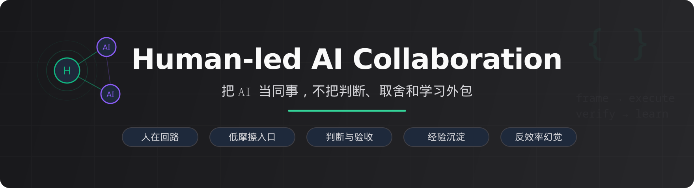

<p align="center">
  
</p>

<p align="center">
  <a href="docs/phd-ai-collab.md"><strong>读主文章</strong></a> · <a href="skills/full/README.md">Skills 目录</a> · <a href="prompts">Prompts</a> · <a href="README.en.md">English</a>
</p>

---

这是一份我在读博士期间持续更新的 **AI 协作手册**。它不是“装哪些工具”的清单，也不是“怎么写 Prompt”的速成教程。它更想回答的是：当 AI 已经能进入学习、科研、写作、编程和日常生活以后，人应该怎样继续主导问题、判断质量、沉淀经验，并避免把理解能力外包出去。

我的核心立场很简单：**把 AI 当同事，不当工具；但人仍然是主变量。** AI 可以帮你探索、生成、执行，但问题表述、验收标准、必要取舍和最终判断不能交出去。否则效率越高，越可能只是更快地制造一种“我好像在推进”的幻觉。

## 先读什么

- **想看完整文章**：从 [`docs/phd-ai-collab.md`](docs/phd-ai-collab.md) 开始。
- **想快速抓主线**：先看下面三张图，再回到文章对应章节。
- **想复用工作流**：看 [`skills/full/README.md`](skills/full/README.md) 和 [`prompts/`](prompts)。
- **想看我怎么约束 Agent**：看 [`AGENTS.md`](AGENTS.md) / [`CLAUDE.md`](CLAUDE.md)。

## 这份手册在讲什么

```text
人是主变量      AI 可以放大能力，但不能替代问题意识和判断力
当同事协作      让 AI 进入真实工作流，而不是停留在一次性问答窗口
低摩擦入口      把划词、IM、远程 Agent 和知识库接到日常材料流里
上下文优先      先准备目标、材料、偏好和验收标准，再让模型执行
经验沉淀        把有效流程固化为 Skill / Workflow，但也要定期做减法
反效率幻觉      警惕把理解、审美、取舍和学习过程一起外包给 AI
```

[](docs/phd-ai-collab.md#code-agent-framework)

## 仓库内容

| 类别 | 入口 | 说明 |
|------|------|------|
| 主文章 | [`docs/phd-ai-collab.md`](docs/phd-ai-collab.md) | 完整方法论，2026-04-26 版 |
| 协作守则 | [`AGENTS.md`](AGENTS.md) / [`CLAUDE.md`](CLAUDE.md) | 我平时真在用的 AI 协作规则 |
| Prompts | [`prompts/`](prompts) | 提示词优化器、概念解释器、论文精读等模板 |
| 完整 Skills | [`skills/full/README.md`](skills/full/README.md) | 仓内所有 Skill 总目录 |
| 配图 | [`docs/figs/`](docs/figs) | 总览图、学习指南、框架图、路线图 |

## 独立维护的 Skills

这些 Skills 已经拆出去单独维护。它们不是全部推荐一次性安装，而是我在不同阶段沉淀过、可以按需参考的工作流：

| Skill | 用途 |
|-------|------|
| [paper-review-pipeline](https://github.com/cnfjlhj/paper-review-pipeline) | 论文审稿流水线 |
| [paperreview](https://github.com/cnfjlhj/paperreview) | 论文评审 |
| [skills-governance](https://github.com/cnfjlhj/skills-governance) | Skills 治理 |
| [session-recovery-codex](https://github.com/cnfjlhj/session-recovery-codex) | 会话恢复 |
| [collaborating-with-codex](https://github.com/cnfjlhj/collaborating-with-codex) | Codex 协作 |
| [completion-learn](https://github.com/cnfjlhj/completion-learn) | 任务完成后的三轴复盘：self → collaboration → tool |
| [xhs-note-creator](https://github.com/cnfjlhj/xhs-note-creator) | 小红书笔记创作 |
| [prompt-polisher](https://github.com/cnfjlhj/prompt-polisher) | 提示词润色 |
| [writing-anti-ai](https://github.com/cnfjlhj/writing-anti-ai) | 去 AI 味写作 |
| [xhs-longform-private-publisher](https://github.com/cnfjlhj/xhs-longform-private-publisher) | 小红书长文发布 |

## 反馈

- 随手留言 / 读后反馈：[Discussions](https://github.com/cnfjlhj/ai-collab-playbook/discussions/1)
- 勘误 / 结构建议：[提 Issue](https://github.com/cnfjlhj/ai-collab-playbook/issues/new/choose)
- 小红书转发版：[链接](https://www.xiaohongshu.com/discovery/item/69ab040f000000001a02d99e)

## 友链

- [linux.do](https://linux.do/)

---

<details>
<summary>Star History</summary>

<a href="https://www.star-history.com/?repos=cnfjlhj%2Fai-collab-playbook&type=date&legend=top-left">
  <picture>
    <source
      media="(prefers-color-scheme: dark)"
      srcset="https://api.star-history.com/image?repos=cnfjlhj/ai-collab-playbook&type=date&theme=dark&legend=top-left"
    />
    <source
      media="(prefers-color-scheme: light)"
      srcset="https://api.star-history.com/image?repos=cnfjlhj/ai-collab-playbook&type=date&legend=top-left"
    />
    
  </picture>
</a>

</details>
