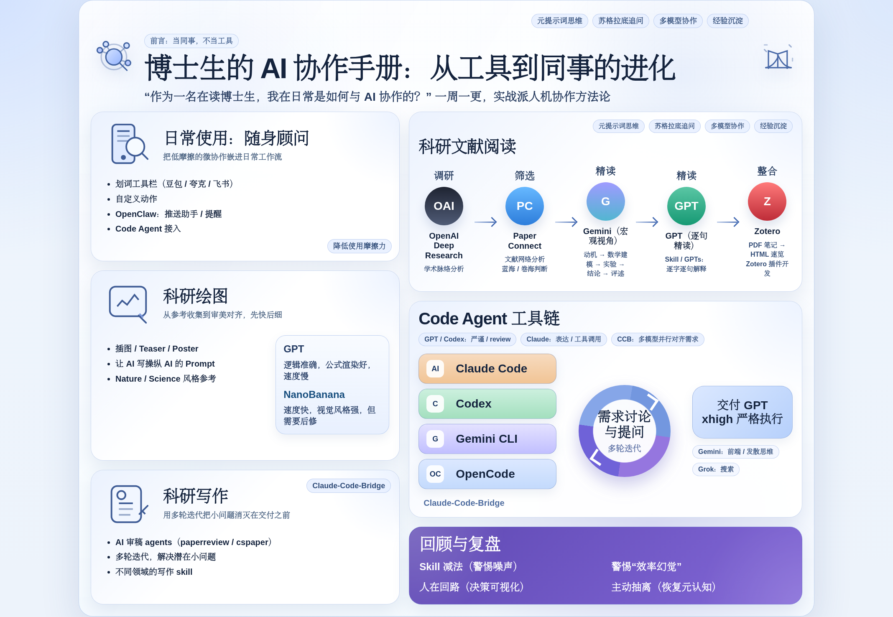

# AI Collab Playbook

[中文] | [English](README.en.md)

这个仓库整理的是我平时和 AI 协作的真实用法：怎么把它接进日常科研、写作、阅读和代码工作流，哪些方式真的长期有用，哪些只是看起来热闹。

如果你是第一次来，建议先从主文章开始；其他 prompts、skills 和守则，都是从这套工作流里慢慢长出来的。

## 先看这里

- **最新文章（2026-03-20 版）**：[`docs/phd-ai-collab.md`](docs/phd-ai-collab.md)
- **直接看第八节：AI 时代生存（学习）指南**：[`docs/phd-ai-collab.md#八ai时代生存学习指南`](docs/phd-ai-collab.md#八ai时代生存学习指南)
- **查看全部配图**：[`docs/figs`](docs/figs)
- **Linux.do 转发版**：<https://linux.do/t/topic/1667121>
- **小红书转发版**：<https://www.xiaohongshu.com/discovery/item/69ab040f000000001a02d99e?source=webshare&xhsshare=pc_web&xsec_token=LBModFyJ1bo4oqM2YmRbD3X0SpH1wO_Yo72JPNGieHJRo=&xsec_source=pc_share>

## 这次更新

这次公开版同步到 `2026-03-20`。除了正文，我也把首页最常用的几张图重新梳理了一遍：总览图之外，还有学习指南、Code Agent 框架和学习路线图三张图。想单独看图可以直接进 [`docs/figs`](docs/figs)；想连着上下文一起看，还是建议回到主文章。

## 仓库里还有什么

- **协作守则**：[`AGENTS.md`](AGENTS.md) / [`CLAUDE.md`](CLAUDE.md)
- **Prompts**：[`prompts/`](prompts)
- **完整 Skills**：[`skills/full/README.md`](skills/full/README.md)
- **更新节奏**：公开版本通常在每周五同步；如果当周有明显改动，也可能提前更新。

## 协作守则

- [`AGENTS.md`](AGENTS.md)：Codex / 通用 agent 协作守则
- [`CLAUDE.md`](CLAUDE.md)：Claude Code 协作守则

这两份文件不是为了展示才放在这里，它们就是我平时真在用的协作规则。如果你也在把 AI 当同事来配合，而不是只拿来问几句，建议早点看。

## Prompts

这些文件是我日常会反复用到的 prompt 模板：

- [`prompts/提示词优化器.md`](prompts/提示词优化器.md)
- [`prompts/概念解释器.md`](prompts/概念解释器.md)
- [`prompts/视频时间戳总结.md`](prompts/视频时间戳总结.md)
- [`prompts/论文精读.md`](prompts/论文精读.md)
- [`prompts/论文转网页.md`](prompts/论文转网页.md)

## 完整 Skills

这里不再列 `skills/*.md` 那层简短卡片，只保留完整 skill 的入口。

- **仓内完整 skills 总目录**：[`skills/full/README.md`](skills/full/README.md)

### 已拆成独立仓的 skills

- [`paper-review-pipeline`](https://github.com/cnfjlhj/paper-review-pipeline)
- [`paperreview`](https://github.com/cnfjlhj/paperreview)
- [`skills-governance`](https://github.com/cnfjlhj/skills-governance)
- [`session-recovery-codex`](https://github.com/cnfjlhj/session-recovery-codex)
- [`collaborating-with-codex`](https://github.com/cnfjlhj/collaborating-with-codex)
- [`xhs-note-creator`](https://github.com/cnfjlhj/xhs-note-creator)
- [`prompt-polisher`](https://github.com/cnfjlhj/prompt-polisher)
- [`writing-anti-ai`](https://github.com/cnfjlhj/writing-anti-ai)
- [`xhs-longform-private-publisher`](https://github.com/cnfjlhj/xhs-longform-private-publisher)

其余仍保留在本仓的完整 skills，可以直接从 [`skills/full/README.md`](skills/full/README.md) 进入。

## 说明

- 这里公开的是我认为适合分享、适合同步到 GitHub 的版本，不等于我本地私有环境配置的完整镜像。
- 主仓优先保留文章、守则和完整 skill 入口；更适合单独维护的 skill 会继续拆成独立仓。
