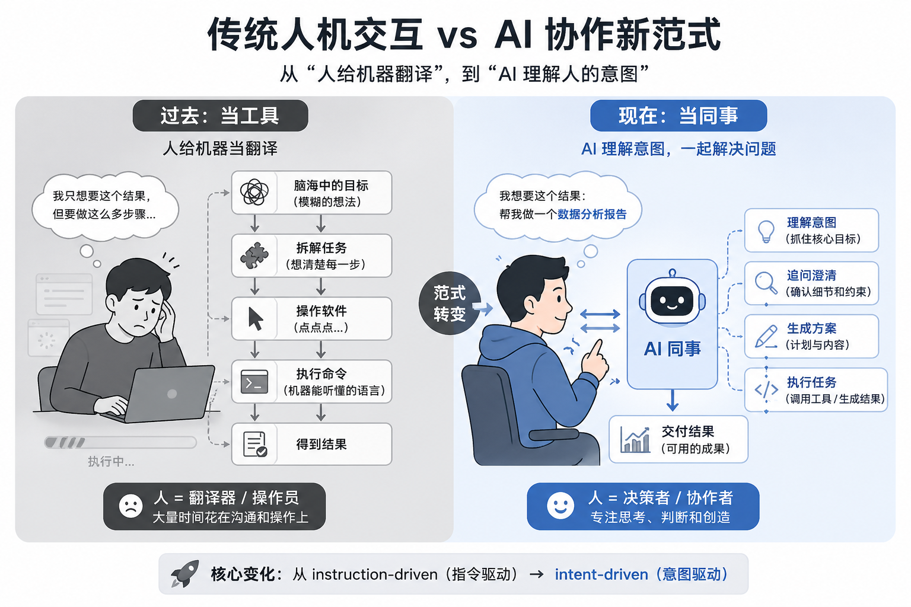
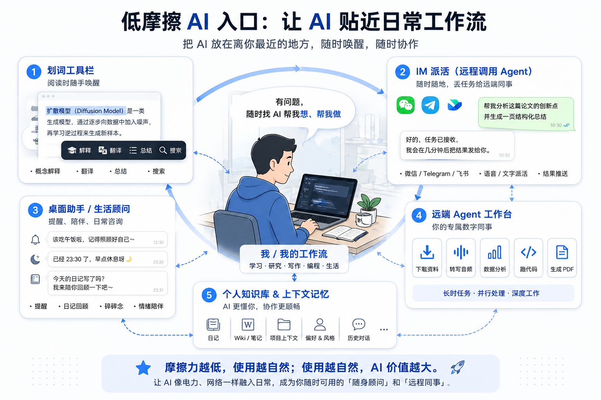
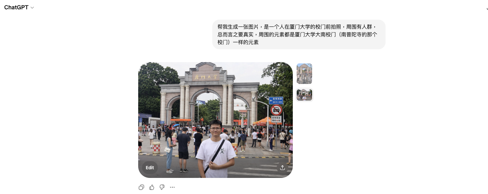
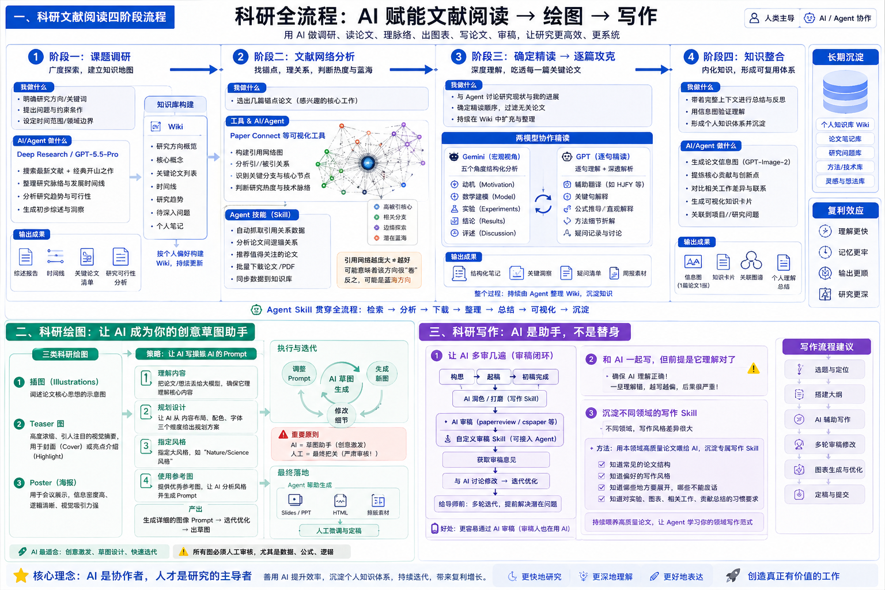
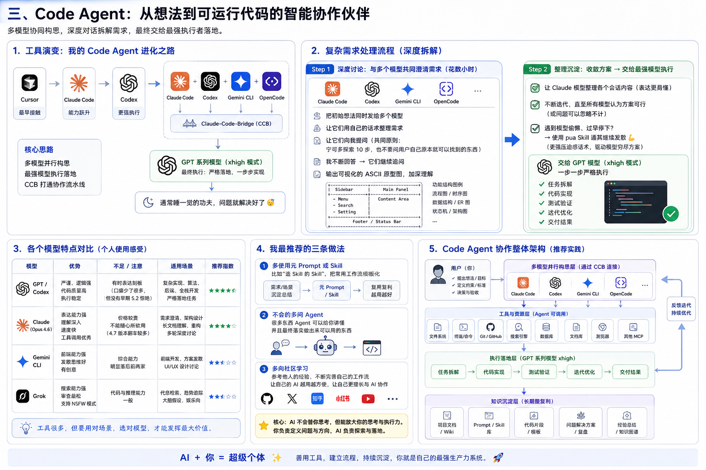
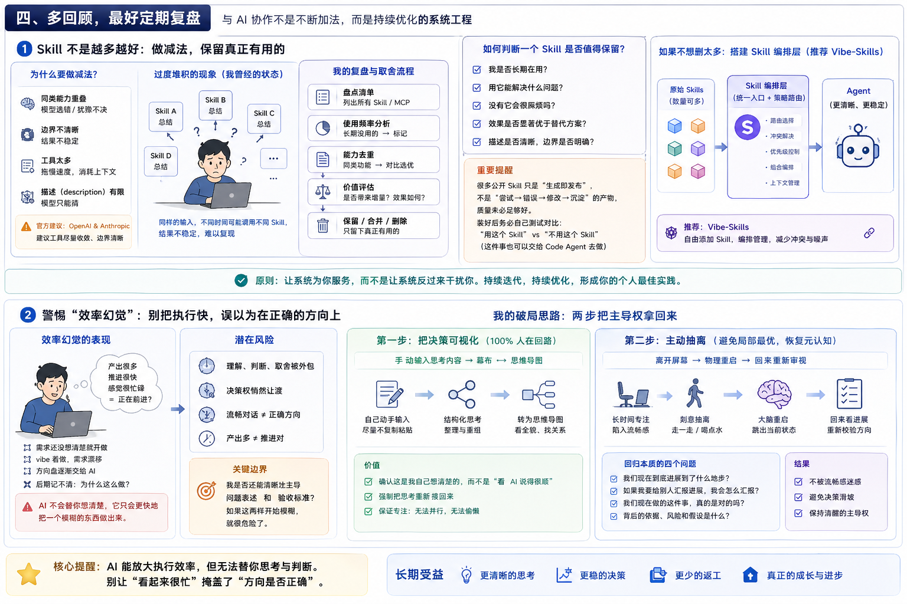
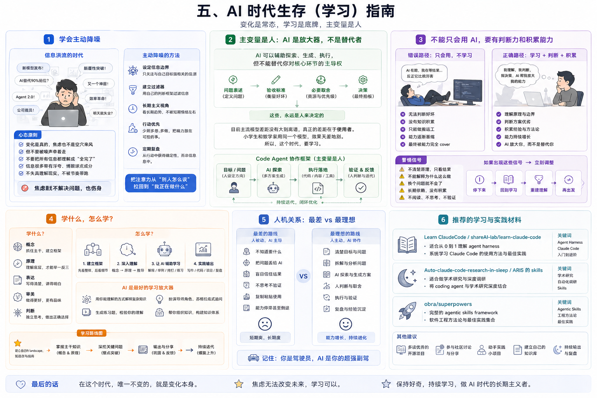

# 作为一名在读博士生，我在日常是如何与 AI 协作的？——ai-collab-playbook

> 公开版本 / Public edition: 2026-04-26
---

## 前言：当同事，不当工具

我是一名人工智能方向的在读博士生，大概在 ChatGPT 出来以后还是 GPT-3.5 的时候就比较重度使用 AI 以及 AI 工具了。几年下来，AI 已经渗透到我工作和学习很多环节，有一些心得想分享一下~

1. **当同事，不当工具**（我认为至少未来几年，应该是人机协作的时代）

   现在回头看，我觉得过去很多所谓“会用电脑”，其实有相当一部分是在给机器当翻译。人脑子里明明只有一个目标，落到电脑上，却总要拆成一堆很零碎的动作。很多时候不是事情本身真有那么复杂，而是旧系统根本听不懂你的意图，只能逼着你先把目标嚼碎，再翻译成它能执行的步骤。这也是为什么我现在越来越自然地把 AI 当同事，而不只是当工具。

2. 几个方法论，贯穿后文的所有场景：

- **元提示词思维**：让 AI 写操纵 AI 的 Prompt，人做微调

- **苏格拉底追问**：让 AI 从多角度逼问自己，把模糊的想法变清晰

- **多模型协作**：不同任务用不同模型（后文会在各个场景展开）

- **经验沉淀**：把流程固化为 Skill（Agent 中的术语）越用越好，越用越快

---

## 一、日常使用：AI 作为随身顾问

### 划词工具栏

我现在主要用的是**豆包的划词工具栏功能**，它能在电脑全局实现划词唤醒。最方便的是支持自定义划词动作——比如我写了一个"概念解释器"，划词后直接给出学术概念的通俗解释，省去了每次都要打开浏览器搜索的麻烦。市面上类似的工具还有夸克、飞书等提供的划词工具栏。更进阶的方案比如 Pot Desktop、Cherry Studio 支持自定义 API（可以接入更强的模型），但目前豆包对我来说够用了。

划词功能，我一般拿来做日常问答以及基本的搜索，翻译这些比较简单的事情。大家在日常使用 AI 的时候可以刻意**降低使用 AI 的摩擦力**，让 AI 的入口尽可能贴近你的工作流。摩擦力越低，越愿意用，AI 能被挖掘出来的价值就容易越大。

### 通过IM软件远程调用Agent

可以通过类似cc-connect，happy这样的应用可以实现用IM软件远程调用现有的本地Coding Agent（ClaudeCode，Codex）也可以直接使用类似OpenClaw，Hermes的成品。

我认为IM是最低摩擦的派活的一个入口，可以随时把任务抛出去，远端机器是Agent的工作台，它可以下载、转写、分析、跑代码、生成 PDF、发回结果。

但最吸引我的还是可持续培养性，让Agent 记得你的偏好、知道你的项目结构、沉淀 skill/workflow，逐渐变成“熟悉我的同事”。

最近我主要是拿他们当咨询类的推送助手，以及提醒我吃饭、睡觉、写日记之类的 chatbot。我会给它我的日记访问权限，让它每天去读我近期的日记，以及往年当天的日记，用来督促我继续写日记。和我一起聊我的零散碎碎念，帮我整理我的知识wiki......

### 谈谈最近的GPT-Image-2

文字回答可以解释概念，但图像可以把层级、关系、流程、对比、因果、空间结构一次性摊开。GPT-Image-2 这类模型的价值，不只是“画得像”，而是能把前面讨论出来的上下文转成可检查、可讨论、可迭代的视觉对象。

与此前的nanobanana类似，当前image model从image generation迈向visual intelligence的模式，模型不仅仅根据提示生成图片，还需要理解上下文、规划版式、保持多图一致性、执行对话式修改，并将丰富上下文转成可视化产物。

GPT-Image-2生成图片的"自然感"能够达到“以假乱真”的水平，这也要求我们提高评价标准，从更细致的内容层面进行检查。（如根据上下文生成科研绘图，应根据自身理解与其进行交叉验证比较）我们已经正式迈入了“有图未必有真相”，“图片内容不再可靠”的时代，未来我们很难通过肉眼以极短的时间判断出来一张高真实度的图片是否可信，可能需要仔细检查细节一致性，逻辑关系，来源链路与发布主体。而不是“看起来像真的”。

最近我真的在看到可能任何一张社交媒体传播的图片，我都会怀疑是不是AI生成的（特别是在这样一个魔幻的时代，看到很多很多可能不太符合正常逻辑的事情发生）

---

## 二、科研

### 科研文献阅读
我把文献阅读分成四个阶段：**调研→筛选→精读→整合**。

#### 阶段一：课题调研

我主要用 **OpenAI 的 Deep Research**以及**GPT-5.5-Pro** 做课题调研以及可行性分析，我会要求 AI 不仅提供最新文献，还必须包含该领域的开山之作，之后将这些内容让agent按照个人偏好去构建wiki。

#### 阶段二：文献网络分析（Literature Network Analysis）

找到几篇感兴趣的论文以后（找到锚点），借助 **Paper Connect** 等工具，可视化文献间的引用关系，快速判断研究热度与技术脉络。（这些数据应该也同步给Agent）

做成适合 Agent 用的 Skill，调研的时候自动分析好文章的引与被引关系，和我交流这些文献，搞清楚这些文献之间的逻辑关系，最终自动下载相关论文以供后续引用或精读。

> 如果某篇论文的引用网络图非常庞大，说明这个方向已经很"卷"了。反之，可能还是蓝海。

#### 阶段三：确定精读 → 逐篇攻克

下载论文到相关文件夹以后，我会先和 Agent 讨论一下当下研究已经推进到了什么地步，再确定阅读顺序，去除无关或暂时不感兴趣的论文。这里常用的就是 Codex、Claude Code这些Cli。（整个过程要逐步扩充整理wiki）

精读环节，我会用**两个模型**配合：

- **Gemini 负责宏观视角**：从 动机→数学建模→实验→结论→评述 五个角度分析一篇论文（这个格式也方便写周报，直接截图就行）

- **GPT 负责逐句精读**：最近我也发现了 HJFY（https://hjfy.top/） 这样的网站，可以先辅助做论文翻译；另外我会结合自己做的 GPT 精读 Skill / GPTs，对关键句子做更细的解释。

#### 阶段四：知识整合

精读讨论清楚了以后，带着完整上下文直接交给gpt-image-2生成信息图（一般一篇论文一张足矣），带着个人的理解与这张图交叉验证，最终存档。

在执行这些过程通过 Agent 的 Skill 打通各个环节，提升速度，带来复利。（等我一阵子开源~最近事情比较多+心情很down）

---

### 关于科研绘图

#### 科研绘图的三个类别

科研绘图分为三类。明白这些术语可以更好地操纵模型绘图：

- **插图（Illustrations）**：阐述论文核心思想的示意图

- **Teaser 图**：在学术界，通常指为一篇论文制作的高度浓缩、引人注目的视觉摘要，常见于顶级期刊的封面（Cover）或亮点介绍（Highlight）

- **Poster（海报）**：学术海报，用于在会议上展示研究成果，要求信息密度高、逻辑清晰且视觉吸引力强

#### 策略：让 AI 写操纵 AI 的 Prompt

我发现让模型去生成 Prompt 的水平远超我自己，尤其是科研绘图方面——让我自己描述，我几乎完全描述不清楚。

我会先让大语言模型理解我的论文内容，然后由它来创造和优化用于生成图像的详细 Prompt。具体来说：

1. 把论文/想法丢给 AI，先问它在**内容布局、配色、字体**三个维度上如何规划

2. 可以主动指定大风格，比如 "Nature/Science 风格"

3. 一个很有效的技巧是**使用参考图**：把日常积累的优秀插图丢给 AI，让它分析风格，再基于你的论文内容生成新图像。

目前我还是把 AI 作为草图助手。出了草图以后，我会尽可能让 Agent 帮我做成 slides 或 HTML，再由我自己微调。AI 绘图需要大量迭代和多次尝试。目前 AI 最适合的角色，还是创意激发和草图设计助手；所有生成结果，尤其是涉及数据和逻辑的部分，依然必须经过严格的人工审核与修正。（严肃！）

---

### 关于科研写作

#### 让 AI 多审几遍

现在 AI 审稿越来越严重，尤其是在 AI 领域。论文构思好以后，起稿阶段就可以先用相关的论文润色 Skill 辅助打稿。有了相对完整的草稿以后，建议多用专业的审稿 Agent 来审。我目前主要用 `paperreview` 和 `cspaper` 这两个网站，前者好像可以无限用，后者每个月有免费次数；另外我也做了一个可以给 Code Agent 调用的 `paperreview` Skill，放在 GitHub 仓库里了。拿到审稿意见以后，再和 AI 讨论哪里需要修改。在给导师看论文之前，先多迭代几轮，把一些潜在的小问题尽量提前解决掉。

另外，其实这样写出来的论文也更容易被 AI 认可；如果审稿人本身也在用 AI 审稿，可能会更容易给 `accept`。

#### 和 AI 一起写，可以，但前提是它真的理解对了

一定一定一定要确保 AI 对内容的理解是正确的，一旦理解错了，后面越写越多，越写越偏，非常危险！

#### 沉淀不同领域的写作 Skill

我现在越来越强烈的感受是：不同领域的论文，写作风格真的不太一样。

有的领域注重严谨推导；有的领域看重叙事铺垫；有的领域对实验细节特别敏感。

所以与其每次都去重新教 AI “这类论文应该怎么写”，不如直接拿本领域你认可的参考论文去喂，慢慢沉淀出一个更适合你自己的写作 Skill。（可以先拿通用的科研写作 Skill 作为底子）

这个 Skill 不一定要多复杂，但它最好是：

- 知道你这个领域常见的论文结构

- 知道你偏好的写作风格

- 知道哪些地方要展开，哪些地方不能废话

- 知道你对实验、图表、相关工作、贡献总结的习惯要求

如果看到读起来特别舒服的高质量论文，也记得让 Code Agent 去学一下。

## 三、Code Agent

### 工具演变

我最先接触 Code Agent 的是 **Cursor**，后面逐步进化到 Claude Code 与 Codex 这些。现在构思的时候是 Claude Code、Codex、Gemini CLI 以及 OpenCode 四个一起用，通过 **Claude-Code-Bridge**（也就是常说的 CCB）。构思清楚以后交给 GPT 模型开 xhigh 模式，一步一步严格执行。通常就是睡一觉的功夫问题就解决好了。

### 复杂需求的处理流程

简单需求就不展开了。说说复杂需求怎么做（参考刘小排的经验）：

**1. 先花数小时时间与多个模型讨论需求细节**

把模糊的想法逐渐写清楚，能够落地。事实上我的很多个想法都是极其模糊的，可能我想的一两句话背后有十几个决策点需要关注。具体做法，我会先把一开始的需求同时发给四个 AI，让他们用自己的话术整理需求，然后向我提问，他们有一个共同的原则：宁可多探索 10 步，也不要问用户自己原本就可以找到的东西。

**2. 我不断回答各个 AI 提出的问题，AI 继续追问**

这个过程要让 AI 多输出可视化的 ASCII 原型图，加深自己的理解。不断让 Claude 模型去整理各个会话的内容（Claude 的模型说的容易懂），不断迭代直到所有 AI 都认为当前的方案已经没有问题或者说问题可以忽略不计，最终交给 GPT 模型完成即可。

如果遇到模型容易偷懒、过早停下来的情况，可以用类似 **pua** 这样的 Skill，适合拿来逼它继续发散。它本质上是用一套更强压迫感的话术，驱动 AI 在放弃前先把方案尽量穷尽。

### 各个模型特点

- **GPT / Codex**：比较严谨。GPT-5.5 相比 GPT-5.4 有了很大的改进，特别是在语言表达上（少了很多口癖，说话没那么令人反感了hhh，但是貌似没有找回以前第一次用gpt-5.2那种感觉）

- **Claude（Opus 4.6）**：表达能力强，速度快，工具调用各个能力都很优秀，但价格比较贵，不能随心所欲的用。貌似Opus 4.7闹出了很多笑话，看来现在GPT-5.5才是那个帕累托最优的模型。

- **Gemini**：前端能力很不错，然后发散思维不错，有时候聊方案的时候会有意想不到的效果。但是跟前两家比明显落后。

- **Grok**：搜索能力很优秀，在审查上应该也是最松的，还有 NSFW 模式。推荐 `grok-search` 这个 MCP。

### 我最推荐的做法

1. **多使用元 Prompt 或 Skill**——比如造 Skill 的 Skill，把常用的工作流模板化

2. **不会的多问 Agent**——很多东西 Agent 可以给你讲懂，并且最终落实做出来可以用的东西。就不断迭代积累经验

3. **多向社区学习**——参考他人的经验，不断完善自己的工作流，让自己的 AI 越用越方便，让自己更擅长与 AI 协作

---

## 四、多回顾，最好定期复盘

### Skill 不是越多越好

Skill / MCP 不是见一个就安一个。我原先就是这样，遇到一个看起来不错的 Skill，就想让我的 Code Agent 给装上。最近回头复盘才发现，自己这里已经堆了很多做同一件事的 Skill。给同样的输入，有时候模型选 A，有时候选 B，有时候选 C，结果并不稳定。毕竟模型在选 Skill 的时候，很多时候只能先看 description。

OpenAI 和 Anthropic 都在官方文档里提到过，相关工具最好尽量收敛一些。当工具数量太多、同类能力重叠、边界又写得不清楚时，模型更容易选错、犹豫、变慢，甚至被长输出拖垮上下文。

所以我现在会定期回头复盘自己的 Skill 和 MCP，看它们到底有没有真正给我带来增量，我到底有没有长期用到它们。如果一个 Skill 只是“当时看起来很厉害”，但后来几乎不用，或者和别的 Skill 做的是同一件事，那我就倾向于把它关掉，甚至直接删掉。相反，如果我发现一个东西自己反复在用，而且确实好用，我就会继续往里看，搞清楚它到底为什么好用，再决定要不要把它沉淀成自己更稳定的一套东西。

另外，其实现在很多网上公开的 Skill，都是遇到需求以后直接让模型写出来的，而不是“尝试 → 错误 → 修改 → 沉淀”的产物，质量未必足够好。装好以后最好自己测一下，看看“用这个 Skill”和“不用这个 Skill”之间到底有没有差别；这件事也可以交给 Code Agent 自己做。

这只是其中一个例子。和 AI 协作不是不断往系统里加东西，也得经常做减法：把真正有用的留下，把制造噪声的去掉。

（但是，我确实逐渐积累了很多很多不愿意删除的skill，所以可以搭建一个skill编排层，我这里比较推荐这个：https://github.com/foryourhealth111-pixel/Vibe-Skills ，可以自由添加skill并入编排层）

### 警惕“效率幻觉”

不知道大家有没有这种感觉：每天用 AI 写代码的时候，产出看起来很多，推进也很快，但等真正沉下心回顾时，却很难说清楚自己到底做了什么，甚至有时候连当时为什么要那样做都不一定想得起来。

某种程度上，AI 把“做”的门槛压得很低，于是人很容易在需求还没想清楚的时候就先开做。想着“这个功能先 vibe 一下再说”，结果写着写着，需求开始漂，方向盘也慢慢交了出去。以前人还可以靠不断操作、不断切软件、不断改细节，制造一种“我在推进”的感觉；现在 AI 会把执行这件事压得更便宜，这层缓冲反而越来越薄。你没有想清楚，它不会替你想清楚，它只会更快地把一个模糊的东西做出来。

如果只是一味把 AI 当替身，让它一路写、一路改、一路带着你走，那本来应该由自己完成的理解、判断和取舍，也会一起被外包出去。最后得到的，可能不是更强的能力，而是一种更流畅的“虚假生产力”。

对我来说，一个很重要的边界就是：我是否还能清晰地主导“问题表述”和“验收标准”。如果这两样开始模糊，那就很危险了。这也是为什么我现在越来越觉得，如果我自己都还不知道想要什么，就先别急着干。后面虽然看起来还在推进，但推进的东西到底对不对，自己其实已经没那么确定了。

我的做法大概有两步。

**第一步，是把决策可视化。**

我会尽量把自己思考的东西打出来，输入到幕布里，再转成思维导图去看。这里最关键的不是工具，而是要自己动手，尽量不要复制粘贴。AI 可以辅助，但这一步我更希望是我自己在输入、在整理、在重新组织。因为只有这样，我才能确认这些内容真的是我自己想清楚的，而不是只是看 AI 说得很顺，就默认它是对的。

某种意义上，这一步对我来说是 100% 的“人在回路”。它会在物理层面强制我把思考重新接回来，同时也能保证持续专注，因为这件事没法并行，也没法偷懒。

**第二步，是主动抽离。**

抽离对我来说，不只是休息一下，而是一个避免局部最优、避免反刍、恢复元认知的过程。

因为和 AI 协作久了以后，很容易出现一种情况：对话越来越顺，内容越来越连贯，于是人会慢慢产生一种“我们正在前进”的感觉。问题在于，这种流畅感本身就会削弱人的警惕性。清醒的时候，你还会不断追问：这一步的依据是什么？风险在哪里？但到了后期，尤其是累的时候，人更容易接受那些“语言上讲得通”的东西，于是决策权就会默默让渡出去。

而且这种让渡通常不是一下子发生的，它更像是一个渐变的滑坡。

所以我的做法会更偏物理一些。比如我坐在电脑前工作一段时间以后，会刻意离开电脑，站起来走一走，喝点水，强制把自己从当前状态里抽出来。我的大脑并没有停止，只是像经历了一次重启。然后我再回来重新看：我们现在到底进展到了什么地步？如果我要给别人汇报进展，我会怎么汇报？我们现在做的这件事，真的是对的吗？

对我来说，这一步很重要。因为很多时候，所谓“效率幻觉”不是你做得不够多，而是你已经做了很多，但你开始说不清自己到底为什么这么做了。

---

## 五、AI时代生存（学习）指南

### 学会主动降噪

这是一个什么时代呢？因为我有每天听播客，看最新的动态的习惯，很容易会有一些错觉：好像每天都有新模型、新工具、新Agent发布，感觉世界每天都在被重写。

变化当然是真的，焦虑也不是空穴来风，很多岗位裁员是真的，岗位收缩是真的，很多公司也确实把 AI、效率、组织重构这些话术和 headcount 变化绑在一起。但越是在这个时候，越不能被噪声牵着走，把所有信息都理解成“全完了，过一阵子就全部都失业了”。

同时，要明白很多信息本身也带着浮夸、博眼球的成分。不要失真地理解现实，不要被节奏带跑，焦虑地过日子，焦虑既不解决问题，也伤身。

### 主变量是人

目前，AI 可以辅助探索、生成、执行。但是不能替代你对【问题表述】【验收标准】【必要取舍】和【决策】的主导权。这应该要成为共识。

变化是真的，所以不能躺平；起码在现在这个阶段，大家能用到的 AI，无论是 GPT、Claude、Gemini，还是国内的 GLM、DeepSeek、Kimi、MiniMax 等等，差距没有大到离谱的程度。（当然，能用最好的还是用最好的）

更大的区别还是在于用 AI 的人。同样的一个模型，不同的人用出来的效果是不一样的。小学生和数学家用同一个 AI 去做数学，最后发挥出来的力量肯定是不一样的。所以说，这个时代，要学习。

如果把“人是主变量”这件事再画得更直接一点，大概就是下面这个样子。

### 不能只会用AI

如果你完全不懂你现在让 AI 做的事情，那你几乎是无法判断和分辨好坏的，也是无法做到经验累积的，你只能做一个搬运工。而这样长期下去，过度依赖 AI 而不学习会导致能力萎缩，最终个人能力可能逐渐倒退至完全被 AI 的能力所 cover，这是很可怕的一件事情。

如果你发现 AI 在跑，你只是盯着控制台发呆，刷手机，最后再把结果原样拿来用，或许该警惕了。

### 学什么，怎么学

学什么呢？去学概念，去学原理，去学表达，去学审美，去学判断。

决定能不能进入一个领域的概念与原理的知识是不会太多的，抓住这些主干，你就能够更快进入这个领域的 space，知道它的大致边界、结构和内在关系。

所以不要碎片化地去追热点，什么火去学什么，可能这样学到的只是表象。应该要去学概念，学原理。建立起自己的 landscape，知道自己在哪，知道哪些概念是主干，哪些是枝叶。然后让 AI 帮你逐步展开、解释、练习。

这是一个非常适合学习的时代。我个人深切感受到了，很多过去晦涩难懂的知识，现在都可以让 AI 用你能理解的话解释；也可以扮演导师的角色拷打你，可以用苏格拉底式的问答逼你去把问题想得更深一点。

再往前走一步，问题就不是“要不要学”了，而是“具体学什么，顺序怎么排”。对我来说，更重要的是先建立 landscape，再沿着概念、原理、表达、审美、判断这几条主线慢慢展开。

### 人机关系

最差的路线是：自己不思考，只会搬运 AI 的答案。

最理想的路线是：自己有知识基础，有判断力，知道什么是好的，知道自己想要什么，然后让 AI 去帮你探索、生成、执行。

### 推荐的一些材料

如果你暂时找不到意义，不知道这样飞速发展的时代应该做什么，感到焦虑和迷茫，那么去学习吧。如果暂时不知道学什么，或者想从 coding agent 这条线入门，我推荐几个对我来说帮助比较大的材料：

- **Learn ClaudeCode / `shareAI-lab/learn-claude-code`**

  适合从 0 到 1 理解 agent harness。

- **Auto-claude-code-research-in-sleep / ARIS 的 skills**

  适合做学术研究，尤其是如果将 coding agent 与学术研究结合。

- **`obra/superpowers`**

  适合看一套完整的 agentic skills framework 和软件工程方法论。

---

## 六、对于我来说，不得不思考的一些问题

### 当未来 AI 产品与我们生活方方面面紧密结合时，会发生什么？

我现在也会警惕另一件事：人和 AI 协作久了以后，不一定只是效率更高了，也可能是在慢慢学会用 AI 听得懂的方式去表达自己。目标可能会变得更结构化，更 AI friendly，原本那些模糊、犹豫的东西是不是会慢慢变少，短期看，是沟通成本变低，执行变快，效率变高了，但反过来看，是不是也意味着我们也正在一点点变成一个更容易被系统理解、也更容易被系统预测的人呢？

另外，这种变化不是单向的， AI 会通过我的历史行为学习我，而我也会通过的和 AI 协作的反馈学会怎么更快地得到结果。久而久之，就可能形成一种闭环：我越来越习惯某种提问方式、某种表达风格，而 AI 也会越来越顺着我，可这就是问题，它这样做太容易让人觉得“这就是我的想法”了，实际上可能是一种坍缩，看似是 AI 和人共同进化，实际上有可能只是**你变简单了**
