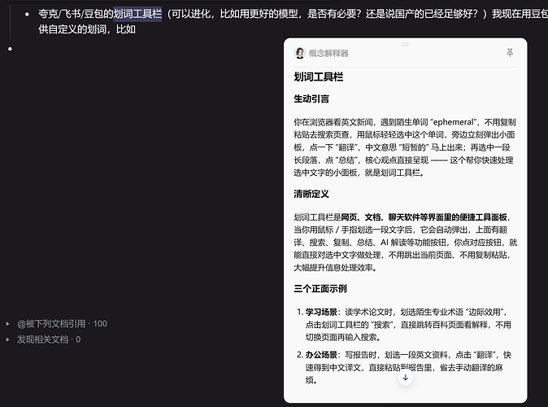
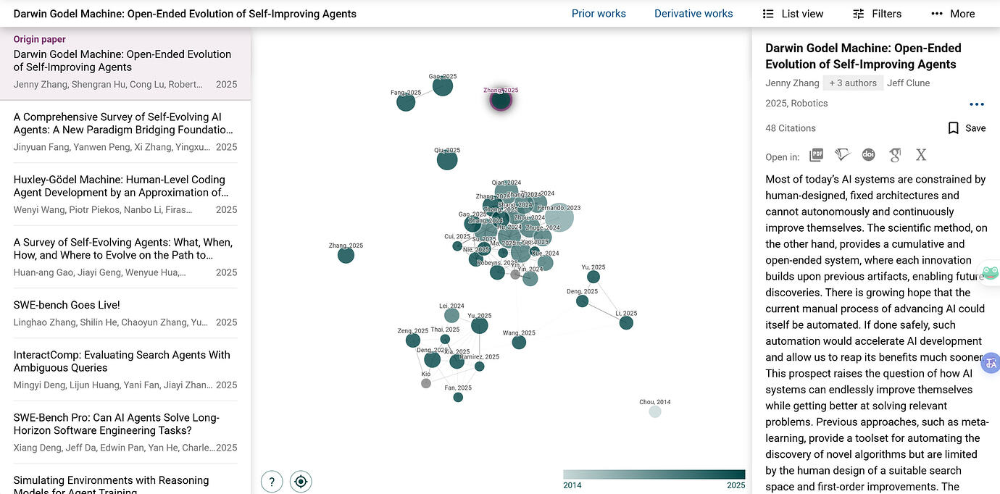
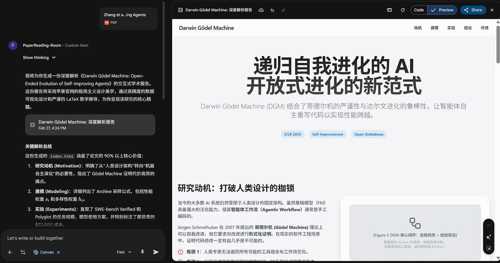
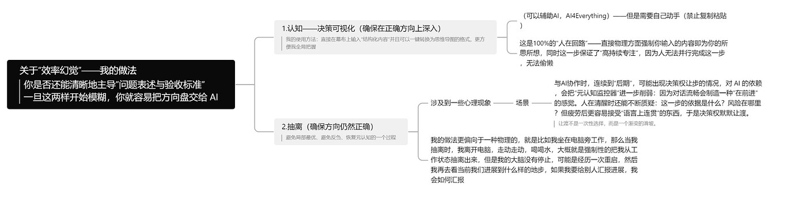

# 作为一名在读博士生，我在日常是如何与 AI 协作的？

---

## 前言：当同事，不当工具

我是一名人工智能方向的在读博士生，大概在 ChatGPT 出来以后还是 GPT-3.5 的时候就比较重度使用 AI 以及 AI 工具了。几年下来，AI 已经渗透到我工作和学习很多环节，有一些心得想分享一下~

1. **当同事，不当工具**（我认为至少未来几年，应该是人机协作的时代）

2. 我的几个方法论，贯穿后文的所有场景：

- **元提示词思维**：让 AI 写操纵 AI 的 Prompt，人做微调

- **苏格拉底追问**：让 AI 从多角度逼问自己，把模糊的想法变清晰

- **多模型协作**：不同任务用不同模型（后文会在各个场景展开）

- **经验沉淀**：把流程固化为 Skill（Agent 中的术语）或 GPTs（Prompts 库），越用越快

---

## 一、日常使用：AI 作为随身顾问

### 划词工具栏

我现在主要用的是**豆包的划词工具栏功能**，它能在电脑全局实现划词唤醒。最方便的是支持自定义划词动作——比如我写了一个"概念解释器"，划词后直接给出学术概念的通俗解释，省去了每次都要打开浏览器搜索的麻烦。市面上类似的工具还有夸克、飞书等提供的划词工具栏。更进阶的方案比如 Pot Desktop、Cherry Studio 支持自定义 API（可以接入更强的模型），但目前豆包对我来说够用了。

划词功能，我一般拿来做日常问答，以及翻译这些比较简单的事情。大家在日常使用 AI 的时候可以刻意**降低使用 AI 的摩擦力**，让 AI 的入口尽可能贴近你的工作流。摩擦力越低，越愿意用，AI 能被挖掘出来的价值就容易越大。

### OpenClaw

调得久了，感觉并没有多惊艳，推荐装上可视化的开源项目，比如三省六部和ClawPanel，如果要做一些比较复杂的任务，推荐事先给OpenClaw的机器安上Codex/ClaudeCode/Gemini-CLI等Code Agent让OpenClaw可以自己调用。
最近主要是拿来当咨询的推送助手，以及当提醒我吃饭/睡觉/写日记等的chatbot，我会给它我的日记访问权限，然后它每天去读我近期的日记，还有一个往年当天的日记。用来督促我继续写日记~

---

## 二、科研文献阅读

我把文献阅读分成四个阶段：**调研→筛选→精读→整合**。

### 阶段一：课题调研

我主要用 **OpenAI 的 Deep Research** 做课题调研（个人认为比 Gemini 的 Deep Research 要好用），我会要求 AI 不仅提供最新文献，还必须包含该领域的开山之作。

我个人比较喜欢从历史脉络的时间线来分析，这时会有一些自己感兴趣的工作，可以标记收藏下来。

### 阶段二：文献网络分析（Literature Network Analysis）

找到几篇感兴趣的论文以后，借助 **Paper Connect** 等工具，可视化文献间的引用关系，快速判断研究热度与技术脉络。

做成适合 Agent 用的 Skill，调研的时候自动分析好文章的引与被引关系，和我交流这些文献，搞清楚这些文献之间的逻辑关系，最终自动下载相关论文以供后续引用或精读。

> 如果某篇论文的引用网络图非常庞大，说明这个方向已经很"卷"了。反之，可能还是蓝海。

### 阶段三：确定精读 → 逐篇攻克

下载论文到相关文件夹，与Code Agent（比如Codex，ClaudeCode，Gemini-CLI）,搞清楚当下研究到了什么样的一个地步，确定阅读顺序，去除无关或不感兴趣的论文。

精读环节，我会用**两个模型**配合：

- **Gemini 负责宏观视角**：从 动机→数学建模→实验→结论→评述 五个角度分析一篇论文（这个格式也方便写周报，直接截图就行）

- **GPT 负责逐句精读**：我做了一个专门的 Skill/GPTs，逐字逐句呈现原文，给出中文翻译和详细的"导师式解释"，尽可能不遗漏论文中的细节

### 阶段四：知识整合

用 **Zotero** 管理文献，在原始 PDF 上增加笔记内容以及 HTML 页面（前面 Gemini 生成的），并 link 上当周的周报，形成一个闭环。

在使用的过程通过 Agent 的 Skill 打通各个环节，提升速度，带来复利。

我正在做一个Zotero的小插件，大概就是导入Zotero以后可以批量的产出HTML速览版以及逐段精读版，逐句精读版是实现缓存好的，到时候想精读拿一部分就按快捷键弹出来解释。等我继续填功能到时候分享给大家~（大家有想补充的也可以提）

---

## 三、关于科研绘图

### 科研绘图的三个类别

科研绘图分为三类。明白这些术语可以更好地操纵模型绘图：

- **插图（Illustrations）**：阐述论文核心思想的示意图

- **Teaser 图**：在学术界，通常指为一篇论文制作的高度浓缩、引人注目的视觉摘要，常见于顶级期刊的封面（Cover）或亮点介绍（Highlight）

- **Poster（海报）**：学术海报，用于在会议上展示研究成果，要求信息密度高、逻辑清晰且视觉吸引力强

### 策略：让 AI 写操纵 AI 的 Prompt

我发现让模型去生成 Prompt 的水平远超我自己，尤其是科研绘图方面——让我自己描述，我几乎完全描述不清楚。

我会先让大语言模型理解我的论文内容，然后由它来创造和优化用于生成图像的详细 Prompt。具体来说：

1. 把论文/想法丢给 AI，先问它在**内容布局、配色、字体**三个维度上如何规划

2. 可以主动指定大风格，比如 "Nature/Science 风格"

3. 一个很有效的技巧是**使用参考图**：把日常积累的优秀插图丢给 AI，让它分析风格，再基于你的论文内容生成新图像

### 一些实测对比

当前文生图模型在理解和呈现**精确逻辑与符号**方面存在普遍短板。AI 可以很好地把握"概念"（至少 Gemini 的理解效果很好），但端到端地完美生成科研绘图目前还做不到（总是存在一些缺陷），整个过程需要**不断迭代和"抽卡"**。

多轮实验对比：

* 概念准确性与文字渲染: 在生成包含核心概念、图表和数学公式的图像时，GPT的表现远超对手。它能更准确地理解并呈现复杂的逻辑关系和符号（如 >=），而nanobanana则频繁出错，文字和公式渲染质量很差。

* 生成速度: nanobanana的速度极快，几乎是即时出图；而 GPT则非常缓慢，有时需要数分钟才能完成。

* 风格模仿: 在模仿《Nature/Science》等顶级期刊的特定风格时，nanobanana在经过多次尝试（“多抽卡”）后，有时能产生在视觉风格上更逼真的结果，但内容准确性依然是短板。

* 复杂任务（Teaser图 & Poster）: 在生成信息密度高、结构复杂的Teaser图和学术海报时，GPT再次展现压倒性优势。其生成的海报布局合理，文字内容基本准确，而nanobanana的版本则内容错乱，几乎不可用。

目前我还是把 AI 作为草图助手，出来草图以后尽可能让 Agent 帮我做出来 slides，然后我在 PPT 上微调。AI 绘图需要大量迭代和多次尝试。目前 AI 最适合的角色是作为创意激发和草图设计的助手，所有生成结果，尤其是涉及数据和逻辑的部分，必须经过严格的人工审核与修正。

---

## 四、关于科研写作

### 让 AI 多审几遍

现在AI审稿越来越严重（尤其是AI领域）。论文构思清楚，要开始写的时候就可以用相关论文润色的skill辅助着打稿了，有相对完整的草稿以后建议多用专业的审稿agent来做，我目前用paperreview（好像是可以无限用？我做了一个可以给codeagent调用的skill也放在github仓库了）和cspaper（每个月有免费次数）这两个网站来审稿，拿到审稿意见以后可以和ai讨论哪里需要修改。在给导师看论文之前可以先多迭代几轮把一些潜在小问题解决掉~

其实这样写出来的论文比较容易被AI认可，如果审稿人用了AI审稿可能会更容易给accept~

### 和 AI 一起写，可以，但前提是它真的理解对了

一定一定一定要确保AI对内容的理解是正确的，一旦理解错了，后面越写越多，越写越偏，非常危险！

### 沉淀不同领域的写作skill

我现在越来越强烈的感受是：不同领域的论文，写作风格真的不太一样。

有的领域注重严谨推导；有的领域看重叙事铺垫；有的领域对实验细节特别敏感。

所以与其每次都去重新教AI“这类论文应该怎么写”，不如直接拿本领域你认可的参考论文去喂，慢慢沉淀出一个更适合你自己这个领域的写作skill。（可以先拿通用的科研写作skill去作为底子）

这个 skill 不一定要多复杂，但它最好是：

- 知道你这个领域常见的论文结构

- 知道你偏好的写作风格

- 知道哪些地方要展开，哪些地方不能废话

- 知道你对实验、图表、相关工作、贡献总结的习惯要求

## 五、Code Agent

### 工具演变

我最先接触 Code Agent 的是 **Cursor**，后面逐步进化到 Claude Code 与 Codex 这些。现在构思的时候是 Claude Code、Codex、Gemini CLI 以及 OpenCode 四个一起用，通过 **Claude-Code-Bridge**（也就是常说的 CCB）。构思清楚以后交给 GPT模型开 xhigh 模式，一步一步严格执行。通常就是睡一觉的功夫问题就解决好了。

### 复杂需求的处理流程

简单需求就不展开了。说说复杂需求怎么做（参考刘小排的经验）：

**1. 先花数小时时间与多个模型讨论需求细节**

把模糊的想法逐渐写清楚，能够落地。事实上我的很多个想法都是极其模糊的，可能我想的一两句话背后有十几个决策点需要关注。具体做法，我会先把一开始的需求同时发给四个 AI，让他们用自己的话术整理需求，然后向我提问，他们有一个共同的原则：宁可多探索 10 步，也不要问用户自己原本就可以找到的东西。

**2. 我不断回答各个 AI 提出的问题，AI 继续追问**

这个过程要让 AI 多输出可视化的 ASCII 原型图，加深自己的理解。不断让 Claude 模型去整理各个会话的内容（Claude 的模型说的容易懂），不断迭代直到所有 AI 都认为当前的方案已经没有问题或者说问题可以忽略不计，最终交给 GPT 模型完成即可。

### 各个模型特点

- **GPT / Codex**：比较严谨，速度比较慢，GPT-5.2 模型是我目前用的觉得是唯一一个能一丝不苟的干活的模型，但语言比较晦涩难懂。我主要用在编写代码以及 review 上。GPT-5.4还没用热乎~但目前用起来体验还是不错，主要是速度太快了我都有点不习惯。

- **Claude（Opus 4.6）**：表达能力强，速度快，工具调用各个能力都很优秀，但价格比较贵，不能随心所欲的用。

- **Gemini**：前端能力很不错，综合能力也比较强，我主要就是拿来做前端的时候用，然后发散思维不错，有时候聊方案的时候会有意想不到的效果。

- **Grok**：搜索能力很优秀，在审查上应该是最松的，有 NSFW 模式。推荐佬友做的grok-search的mcp

### 我最推荐的做法

1. **多使用元 Prompt 或 Skill**——比如造 Skill 的 Skill，把常用的工作流模板化

2. **不会的多问 Agent**——很多东西 Agent 可以给你讲懂，并且最终落实做出来可以用的东西。就不断迭代积累经验

3. **多向社区学习**——参考他人的经验，不断完善自己的工作流，让自己的 AI 越用越方便，让自己更擅长与 AI 协作

---

## 六、多回顾，最好定期复盘

### Skill 不是越多越好

skill / MCP 不是见一个就安一个。我原先就是这样，遇到一个看起来不错的 skill，就想让我的 Code Agent 给装上。最近回头复盘才发现，自己这里已经堆了很多做同一件事的 skill。给同样的输入，有时候模型选 A，有时候选 B，有时候选 C，结果并不稳定。毕竟模型在选 skill 的时候，很多时候只能先看 description。

OpenAI 和 Anthropic 都在官方文档里提到过，相关工具最好尽量收敛一些。当工具数量太多、同类能力重叠、边界又写得不清楚时，模型更容易选错、犹豫、变慢，甚至被长输出拖垮上下文。

所以我现在会定期回头复盘自己的 skill 和 MCP，看它们到底有没有真正给我带来增量，我到底有没有长期用到它们。如果一个 skill 只是“当时看起来很厉害”，但后来几乎不用，或者和别的 skill 做的是同一件事，那我就倾向于把它关掉，甚至直接删掉。相反，如果我发现一个东西自己反复在用，而且确实好用，我就会继续往里看，搞清楚它到底为什么好用，再决定要不要把它沉淀成自己更稳定的一套东西。

这只是其中一个例子。和 AI 协作不是不断往系统里加东西，也得经常做减法：把真正有用的留下，把制造噪声的去掉。

### 警惕“效率幻觉”

不知道大家有没有这种感觉：每天用 AI 写代码的时候，产出看起来很多，推进也很快，但等真正沉下心回顾时，却很难说清楚自己到底做了什么，甚至有时候连当时为什么要那样做都不一定想得起来。

某种程度上，AI 把“做”的门槛压得很低，于是人很容易在需求还没想清楚的时候就先开做。想着“这个功能先 vibe 一下再说”，结果写着写着，需求开始漂，方向盘也慢慢交了出去。看起来一开始是省时间了，但如果方向没对，后面很容易又把时间花回到反复和 AI 对需求、改 prompt、再返工上。

如果只是一味把 AI 当替身，让它一路写、一路改、一路带着你走，那本来应该由自己完成的理解、判断和取舍，也会一起被外包出去。最后得到的，可能不是更强的能力，而是一种更流畅的“虚假生产力”。

对我来说，一个很重要的边界就是：我是否还能清晰地主导“问题表述”和“验收标准”。如果这两样开始模糊，那就很危险了。这往往意味着，后面虽然还在推进，但推进的方向到底对不对，自己已经没那么确定了。

我的做法大概有两步。

**第一步，是把决策可视化。**

我会尽量把自己思考的东西打出来，输入到幕布里，再转成思维导图去看。这里最关键的不是工具，而是要自己动手，尽量不要复制粘贴。AI 可以辅助，但这一步我更希望是我自己在输入、在整理、在重新组织。因为只有这样，我才能确认这些内容真的是我自己想清楚的，而不是只是看 AI 说得很顺，就默认它是对的。

某种意义上，这一步对我来说是 100% 的“人在回路”。它会在物理层面强制我把思考重新接回来，同时也能保证持续专注，因为这件事没法并行，也没法偷懒。

**第二步，是主动抽离。**

抽离对我来说，不只是休息一下，而是一个避免局部最优、避免反刍、恢复元认知的过程。

因为和 AI 协作久了以后，很容易出现一种情况：对话越来越顺，内容越来越连贯，于是人会慢慢产生一种“我们正在前进”的感觉。问题在于，这种流畅感本身就会削弱人的警惕性。清醒的时候，你还会不断追问：这一步的依据是什么？风险在哪里？但到了后期，尤其是累的时候，人更容易接受那些“语言上讲得通”的东西，于是决策权就会默默让渡出去。

而且这种让渡通常不是一下子发生的，它更像是一个渐变的滑坡。

所以我的做法会更偏物理一些。比如我坐在电脑前工作一段时间以后，会刻意离开电脑，站起来走一走，喝点水，强制把自己从当前状态里抽出来。我的大脑并没有停止，只是像经历了一次重启。然后我再回来重新看：我们现在到底进展到了什么地步？如果我要给别人汇报进展，我会怎么汇报？我们现在做的这件事，真的是对的吗？

对我来说，这一步很重要。因为很多时候，所谓“效率幻觉”不是你做得不够多，而是你已经做了很多，但你开始说不清自己到底为什么这么做了。

（关于一些prompt 和 skill的分享我还得再整理一下~写完这个太晚了欸）